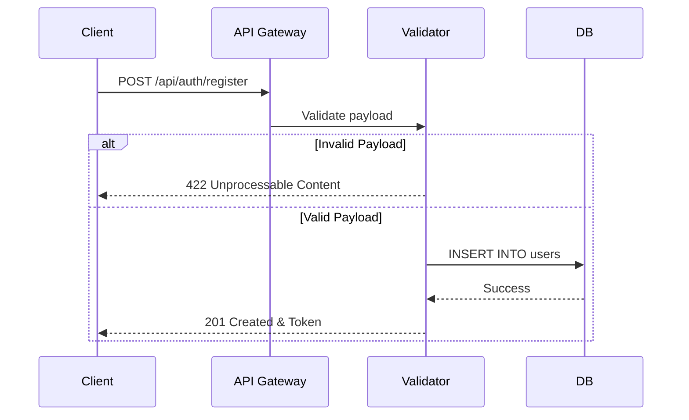
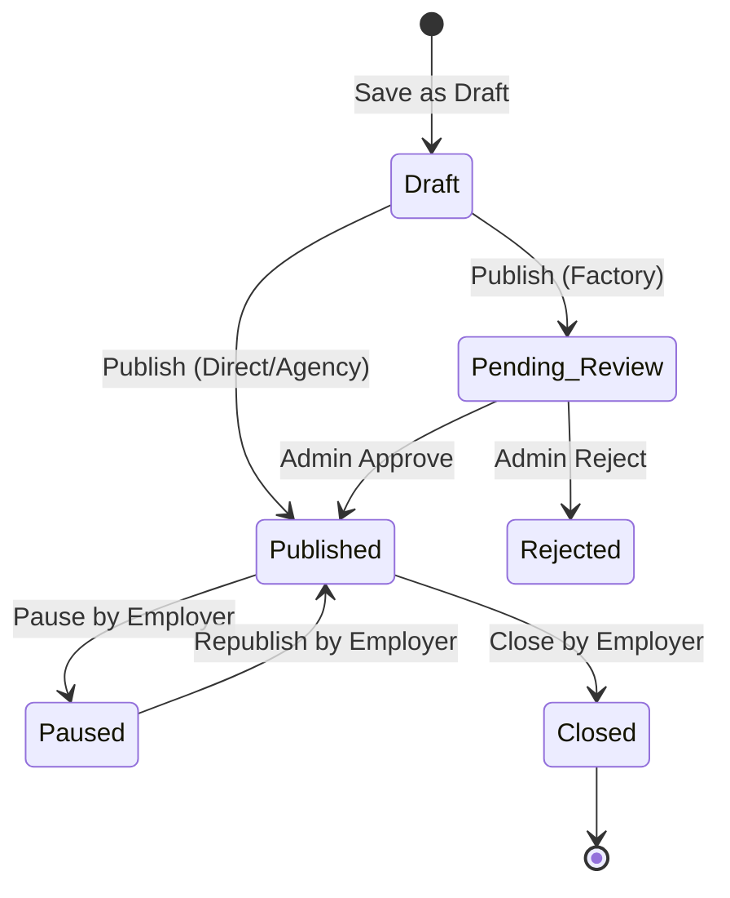

# Master QA Test Case Specification & Test Suite Hyper-Detailed (v4.0.0)

Dokumen ini berisi spesifikasi pengujian fungsional, keamanan, integrasi, basis data, dan performa tingkat lanjut untuk platform **2ne5 Migrant Work**. Dokumen ini dirancang khusus sebagai panduan pengujian manual menyeluruh (*Manual Testing Guide*) maupun cetak biru penulisan pengujian otomatis (*Automation Script Blueprint* seperti Selenium, Appium, Cypress, atau PHPUnit).

---

## 🛠️ PANDUAN LINGKUNGAN PENGUJIAN (TEST ENVIRONMENT SETUP)
1. **API Host URL (Produksi):** `http://130.94.34.24`
2. **API Host URL (Lokal):** `http://localhost` atau `http://10.0.2.2:8000` (untuk Emulator Android)
3. **Database Engine:** PostgreSQL v15+
4. **Mail Catcher:** Mailtrap SMTP Sandbox (`sandbox.smtp.mailtrap.io`)
5. **Admin Web URL:** `http://130.94.34.24/admin`

> [!NOTE]
> Semua pengujian API harus mencantumkan header `Accept: application/json` dan `Authorization: Bearer <token>` (jika endpoint membutuhkan autentikasi).

---

## 📊 PERFORMANCE TESTING BASELINES (Kriteria Lulus)

Sebelum masuk ke Functional Testing, sistem harus memenuhi metrik performa berikut di bawah beban normal:
- **API Response Time (P95):** < 300ms untuk endpoint read, < 800ms untuk endpoint write (upload CV, publish job).
- **Database Query Time:** < 50ms untuk pencarian lowongan dengan filter dan pagination.
- **Concurrent Users (Load Test):** Sistem chat dapat menangani 500 koneksi simultan (WebSocket/Polling) tanpa latensi pesan melebihi 2 detik.
- **FCM Push Notification Latency:** < 5 detik sejak trigger dikirim dari backend hingga diterima device.

---

## 📋 DAFTAR SKENARIO TEST CASES LENGKAP (MILESTONE 0 - 20)

### 🔐 MILESTONE 1: Authentication & User Role System

#### **TC-M1-01: Registrasi Akun Pekerja - Boundary & Validation Analysis**
*   **Tujuan:** Menguji seluruh kemungkinan *edge cases* pada proses registrasi pekerja, memastikan keamanan data dan sanitasi input.
*   **Endpoint:** `POST /api/auth/register`
*   **Request / Response Flow:**

*   **Boundary Conditions:**
    *   `full_name`: Min 3 chars, Max 100 chars. Alpha-numeric & spaces only.
    *   `password`: Min 8 chars, 1 uppercase, 1 symbol, 1 number.
*   **Skenario Pengujian:**
    | No | Skenario | Payload Input | HTTP Status | Error Code / Message | DB State (Before -> After) |
    |---|---|---|---|---|---|
    | 1.1 | Sandi Lemah (Tanpa Huruf Besar) | `"password": "password123!"` | 422 | `The password field must contain at least one uppercase letter.` | 0 rows -> 0 rows |
    | 1.2 | Sandi Lemah (Tanpa Simbol/Angka) | `"password": "Password"` | 422 | `The password field must contain at least one symbol and one number.` | 0 rows -> 0 rows |
    | 1.3 | Nama < 3 Karakter (Boundary) | `"full_name": "Al"` | 422 | `The full_name must be at least 3 characters.` | 0 rows -> 0 rows |
    | 1.4 | Email Sudah Terdaftar | `"email": "existing@mail.com"` | 422 | `The email has already been taken.` | 1 row -> 1 row (No Insert) |
    | 1.5 | Payload Sempurna | Valid data | 201 | `Success` + Token dikembalikan | 0 rows -> 1 row (Inserted) |

#### **TC-M1-02: Batasan Percobaan Verifikasi OTP Email (Brute Force Prevention)**
*   **Tujuan:** Memblokir pengguna yang mencoba menebak kode OTP email secara berulang.
*   **Endpoint:** `POST /api/auth/verify-email-otp`
*   **Langkah-langkah:**
    1. Kirim request ke `verify-email-otp` dengan email target `target@example.com` dan kode salah `111111`.
    2. Ulangi langkah di atas sebanyak 5 kali berturut-turut.
    3. Masukkan kode OTP yang benar (`123456`) pada percobaan ke-6.
*   **Hasil Diharapkan:**
    *   Percobaan 1 s.d. 5 ditolak dengan HTTP `400 Bad Request` dan JSON `{"error": "invalid_code"}`.
    *   Percobaan ke-6 ditolak dengan HTTP `429 Too Many Requests` meskipun kodenya benar, dengan pesan *"Too many attempts, please try again in 15 minutes."*
*   **DB State:** Kolom `email_verified_at` pada tabel `users` tetap `NULL`. Rate limiter tersimpan di cache Redis.

#### **TC-M1-03: Login Google - Verifikasi Validitas Firebase Token**
*   **Tujuan:** Mencegah login menggunakan Firebase Token palsu/manipulasi (Security Check).
*   **Endpoint:** `POST /api/auth/google`
*   **Request Payload (Manipulasi Token):**
    ```json
    {
      "firebase_token": "eyJhbGciOiJSUzI1NiIsImtpZCI6ImZha2VfdG9rZW5faWQiLCJ0eXAiOiJKV1QifQ.fake_payload.fake_signature"
    }
    ```
*   **Hasil Diharapkan:**
    *   Sistem backend memanggil Firebase SDK/API dan mendeteksi tanda tangan token tidak valid.
    *   HTTP Status Code: `401 Unauthorized`
    *   Respons JSON: `{"success": false, "error": "invalid_token", "message": "The provided Google token is invalid."}`

---

### 📄 MILESTONE 2: Worker Profile & CV System

#### **TC-M2-01: Validasi MIME Spoofing Pengunggahan CV Pekerja**
*   **Tujuan:** Mencegah eksekusi kode berbahaya lewat berkas non-PDF yang namanya dimanipulasi menjadi `.pdf`.
*   **Endpoint:** `POST /api/auth/cv`
*   **Langkah-langkah:**
    1. Siapkan berkas biner script berbahaya (cth: file php `shell.php`).
    2. Ganti nama berkas tersebut menjadi `my_resume.pdf`.
    3. Unggah file tersebut via form-data `cv`.
*   **Hasil Diharapkan:**
    *   Sistem membaca *magic bytes* MIME asli sebagai `text/x-php`.
    *   Sistem menolak dengan HTTP `422 Unprocessable Content`: *"The cv field must be a file of type: pdf."*
    *   Berkas tidak tersimpan di direktori `storage/app/public/cvs/`.

#### **TC-M2-02: DB State Transition - Checklist Dokumen Persyaratan Berdasarkan Jenis Pekerja**
*   **Tujuan:** Memastikan tabel `worker_document_requirements` diisi otomatis berdasarkan `user_type` di tabel `users`.
*   **DB Before State:** Tabel `worker_document_requirements` kosong untuk ID User baru.
*   **Action:** Registrasi sukses sebagai `student`.
*   **DB After State Verification:**
    ```sql
    -- Memeriksa tipe dokumen yang wajib diunggah pelajar
    SELECT dt.slug 
    FROM worker_document_requirements wdr
    JOIN document_types dt ON wdr.document_type_id = dt.id
    WHERE wdr.user_id = (SELECT id FROM users WHERE email = 'pelajar@example.com');
    ```
    **Output yang diharapkan (3 baris):** `student_work_permit`, `enrollment_proof`, `cv`.

---

### 🏢 MILESTONE 3: Employer Profile & Verification System

#### **TC-M3-01: Otorisasi Publikasi Lowongan Kerja untuk Majikan Baru**
*   **Tujuan:** Memastikan majikan baru tidak bisa mempublikasikan lowongan sebelum diverifikasi oleh admin.
*   **Prasyarat:** Akun majikan terdaftar dengan status `verification_status = 'unverified'`.
*   **Endpoint:** `POST /api/jobs`
*   **Skenario Uji:**
    | No | Payload `status` | Kondisi Majikan | HTTP Status | Respons | DB State |
    |---|---|---|---|---|---|
    | 1 | `"published"` | `unverified` | 403 Forbidden | `{"error": "unverified_employer"}` | Ditolak |
    | 2 | `"draft"` | `unverified` | 201 Created | Success menyimpan draft | Draft Tersimpan |
    | 3 | `"published"` | `verified` | 201 Created | Success publikasi (atau pending review) | Published/Review |

#### **TC-M3-02: Negative Test - Agensi Tanpa Lisensi**
*   **Tujuan:** Memblokir agensi yang mencoba memposting lowongan tanpa nomor izin resmi (`license_number`).
*   **Endpoint:** `POST /api/jobs`
*   **Hasil Diharapkan:**
    *   Jika `license_number` IS NULL di tabel `employer_profiles`, HTTP `403 Forbidden`.
    *   Pesan: *"Agensi wajib mencantumkan nomor lisensi (License Number) yang terverifikasi."*

---

### 💼 MILESTONE 4: Job Posting System

#### **TC-M4-01: Siklus Perubahan Status Lowongan Kerja (Status Transitions Flow)**
*   **Tujuan:** Menguji FSM (Finite State Machine) dari lowongan pekerjaan.

*   **DB Transitions Test:**
    1. Simpan Draft: `status = 'draft'`
    2. Publish (Agensi): `status = 'published'`
    3. Pause (Endpoint `/api/jobs/{id}/pause`): `status = 'paused'`
    4. Close (Endpoint `/api/jobs/{id}/close`): `status = 'closed'`

---

### 🔍 MILESTONE 5: Job Review & Fake Vacancy Detection

#### **TC-M5-01: Validasi Minimum Gaji (Undang-Undang Taiwan)**
*   **Tujuan:** Memblokir lowongan dengan gaji "Nego" / "面議" yang nominal minimumnya berada di bawah NT$40.000.
*   **Endpoint:** `POST /api/jobs`
*   **Input Combinations:**
    *   `salary = "NT$ 30,000 Nego"` -> HTTP 422, Error: `invalid_salary_hidden`
    *   `salary = "面議"` -> HTTP 422, Error: `invalid_salary_hidden`
    *   `salary = "NT$ 40,000 Nego"` -> HTTP 201 (Valid, pass rule)
    *   `salary = "NT$ 27,470"` (UMP normal, bukan Nego) -> HTTP 201 (Valid)

#### **TC-M5-02: Auto-Screening Scam Keywords**
*   **Tujuan:** Memastikan kata kunci penipuan memicu penolakan otomatis.
*   **Payload Description:** `"Dibutuhkan pekerja perakitan. Wajib membayar biaya pendaftaran (registration fee) awal."`
*   **Hasil Diharapkan:**
    *   HTTP Status 200 OK (Sistem menerima tapi menolak di latar belakang).
    *   DB Record: `status = 'rejected'`, `risk_level = 'critical'`, `rejection_reason = 'Automatically rejected due to prohibited content: registration fee.'`

---

### 🤝 MILESTONE 6 & 7: Job Search, Apply & Applicant Management

#### **TC-M6-01: Concurrency Testing & Pembatasan Lamaran Ganda (Race Condition Prevention)**
*   **Tujuan:** Mencegah pekerja melamar dua kali pada milidetik yang sama menggunakan bot atau script.
*   **Langkah-langkah:** Tembak endpoint `POST /api/jobs/{id}/apply` secara bersamaan (concurrent) sebanyak 5 kali dengan token yang sama.
*   **Hasil Diharapkan:**
    *   Hanya 1 request yang menghasilkan HTTP 201 Created.
    *   4 request lainnya ditolak dengan HTTP 400 `already_applied` atau HTTP 429 Rate Limited.
    *   Database hanya mencatat 1 baris lamaran di tabel `applications`.

#### **TC-M7-01: Otorisasi Obrolan (Chat Gate Authorization)**
*   **Skenario Uji Tabel Akses Pesan:**
    | Pengirim | Penerima | Status Lamaran | Tindakan Majikan | HTTP Status Akses |
    |---|---|---|---|---|
    | Pekerja | Majikan | Belum Melamar | - | 403 `chat_not_opened` |
    | Pekerja | Majikan | Pending | Belum Dibaca | 403 `chat_not_opened` |
    | Majikan | Pekerja | Pending | Belum Dibaca | 201 Created (Majikan berhak init) |
    | Pekerja | Majikan | Shortlisted | Klik "Open Chat" | 201 Created (Dua arah terbuka) |

---

### 💬 MILESTONE 8 & 9: Chat System & Translation Subscription

#### **TC-M8-01: Load Testing WebSocket / Real-Time Chat**
*   **Tujuan:** Memastikan server chat mampu menangani pesan beruntun (spam) tanpa crash.
*   **Simulasi:** Kirim 50 pesan dalam waktu 2 detik melalui endpoint chat/websocket.
*   **Hasil Diharapkan:**
    *   Rate limiting API akan memotong setelah X pesan per detik (menghasilkan HTTP 429).
    *   Pesan yang berhasil akan di-*broadcast* ke klien penerima dalam waktu < 500ms.

#### **TC-M9-01: Mekanisme Pemotongan Kuota Terjemahan & Boundary Limit**
*   **Tujuan:** Memastikan kuota berlangganan berkurang secara absolut dan konsisten di Database.
*   **Skenario Uji:**
    *   DB Before: `user_quotas.translation_quota = 2`
    *   Hit API: `POST /api/chats/messages/1/translate` (Berhasil). DB After: `quota = 1`.
    *   Hit API: `POST /api/chats/messages/2/translate` (Berhasil). DB After: `quota = 0`.
    *   Hit API: `POST /api/chats/messages/3/translate` (Gagal). HTTP 402 Payment Required, Code: `quota_exceeded`.

---

### 🤖 MILESTONE 10: AI Job Safety Checker

#### **TC-M10-01: Vision API - Screenshot Analyzer**
*   **Tujuan:** Menguji responsibilitas Gemini Vision menangani file gambar dan mereturn format JSON statis.
*   **Payload:** Multipart form-data dengan file `image=scam_line.png`.
*   **Ekspektasi JSON Respons:**
    ```json
    {
      "success": true,
      "data": {
        "risk_level": "critical",
        "risk_reasons": ["Upaya pemerasan", "Transfer bank luar sistem"],
        "recommended_action": "Laporkan ke admin dan jangan transfer."
      }
    }
    ```

---

### ⚖️ MILESTONE 11: Report & Trust System

#### **TC-M11-01: Dampak Penalti Laporan Valid (DB State Transition)**
*   **Tujuan:** Mengkalkulasi penalti otomatis dari laporan yang ditandai valid oleh Admin.
*   **Aksi:** Admin mengirimkan HTTP `POST /api/admin/reports/{id}/resolve` dengan `action = "valid_suspend"`.
*   **Transisi Database (Trigger / Logic di Controller):**
    *   `users.trust_score`: Berkurang dari 100 menjadi 80 (jika penalti -20 poin).
    *   `job_posts.status`: Dari `published` menjadi `suspended` jika terkait lowongan.
    *   `reports.status`: Dari `pending` menjadi `resolved`.

---

### 🖥️ MILESTONE 12 & M13: Admin Panel & Payment System

#### **TC-M13-01: Mock Webhook Pembayaran Langganan**
*   **Tujuan:** Menyimulasikan callback dari Payment Gateway.
*   **Endpoint:** `POST /api/webhooks/payment`
*   **Request Payload (Stripe/LinePay Mock):**
    ```json
    {
      "transaction_id": "tx_mock_12345",
      "user_id": 10,
      "status": "success",
      "plan": "weekly"
    }
    ```
*   **Hasil Diharapkan:**
    *   Tabel `transactions`: INSERT 1 row dengan status sukses.
    *   Tabel `subscriptions`: UPDATE user ID 10 mengubah `expires_at` ke waktu `NOW() + 7 Days`.
    *   API Response HTTP 200 OK (untuk memberi tahu payment gateway bahwa webhook diterima).

---

### 📢 MILESTONE 14 & M15: Advertisement & Notification System

#### **TC-M15-01: Push Notification Multicast Flow**
*   **Alur Pengujian:**
    1. Admin mengisi broadcast di Web Admin Panel.
    2. Backend menarik 10.000 `fcm_token` dari database dengan metode paginasi (Chunking).
    3. Backend memanggil Firebase Admin SDK secara *queued/asynchronous*.
    4. Worker Supervisor (`php artisan queue:work`) memproses pengiriman.
*   **Verifikasi Eksekusi:** Pastikan tidak ada Timeout HTTP 504 di sisi Admin, karena proses dikerjakan di latar belakang (Background Jobs).

---

### 🌐 MILESTONE 16 & M17: Multilingual, Security & Privacy

#### **TC-M17-01: Authorization Bypass (IDOR) pada File CV**
*   **Tujuan:** Mencegah Insecure Direct Object Reference (IDOR) pada unduhan berkas privat.
*   **Skenario Uji:**
    *   Pekerja A (ID:1) melamar ke Majikan B (ID:2). Majikan B dapat membuka `/api/cv/download/1`.
    *   Majikan C (ID:3, tidak ada kaitan lamaran) menembak URL `/api/cv/download/1`.
*   **Hasil Diharapkan:** HTTP Status 403 Forbidden. Pesan: `You are not authorized to view this document.` Sistem mengecek tabel `applications` untuk verifikasi otorisasi akses.

---
**Dokumen ini adalah *Single Source of Truth* untuk tim QA. Jika ditemukan anomali perilaku di luar spesifikasi ini, harap buat tiket Bug di Jira/Trello proyek!**
